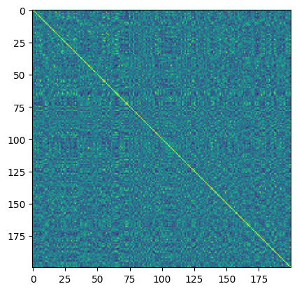
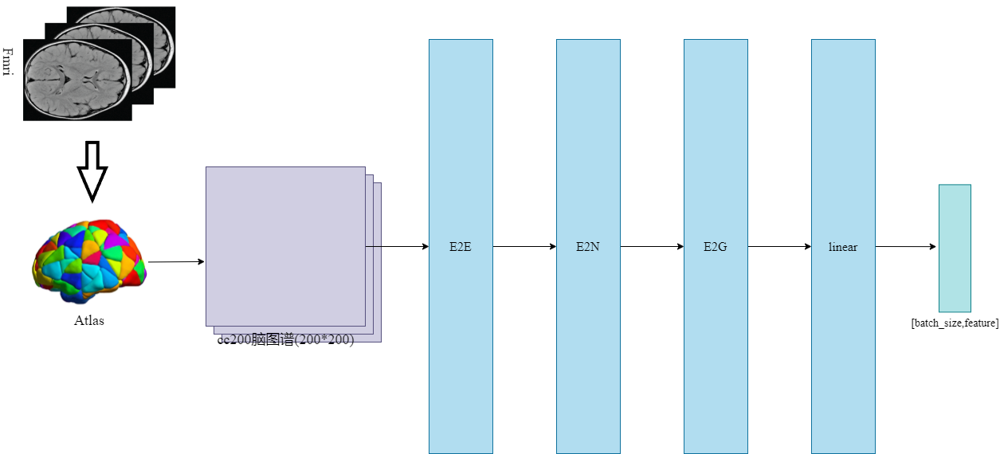
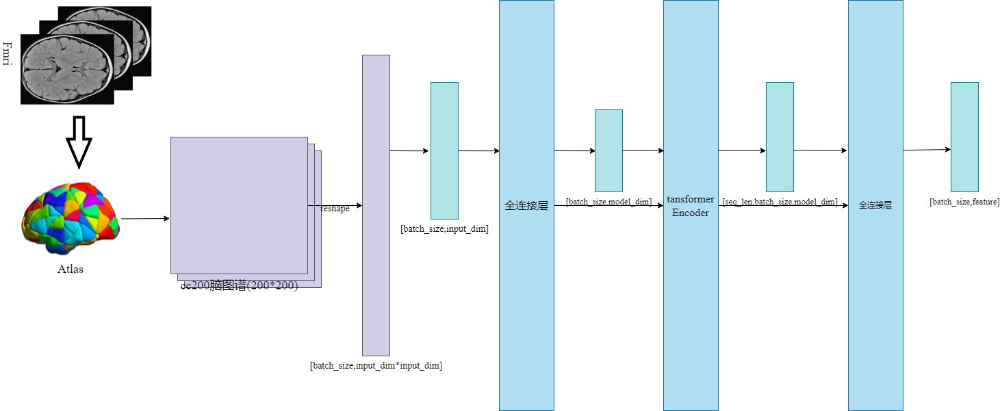
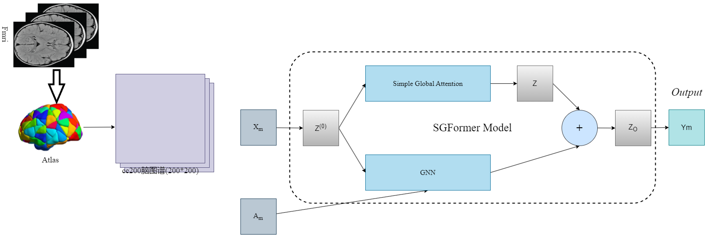
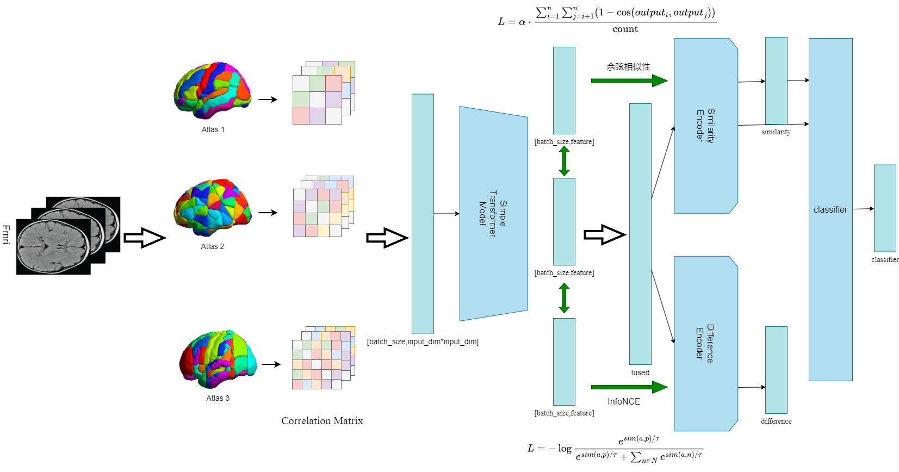

# NEU_MultiModalBrainModel

基于功能脑网络多模版学习的精神疾病辅助诊断算法研究

我阅读了大量关于功能脑网络分析、多模态学习、图嵌入学习、以及神经科学领域精神疾病的诊断研究文献。

不同的脑模版生成的脑网络的主要区别在于脑区划分的粒度不同，导致在不同脑模板上有多种视角的信息表达，因此多模版脑网络学习实际上是一种多视图学习。以往的工作可分为两类。传统的机器学习方法独立的抽取各个视图的特征之后用于疾病分类，忽略了不同视图之间的关联和信息冗余。另一类工作主要采用图嵌入学习方法深度挖掘脑网络特征，通过最大限度地提高不同视图之间的相互一致性，从而捕捉不同视图之间的关联，但不同视图之间高度冗余信息并没有得以处理，影响了信息融合。因此，目前急需一种有效的手段充分有效融合多视图图信息。

## 数据集

在脑网络研究中，常用的脑区划分模板有多个，包括 AAL（Automated Anatomical Labeling）、CC200（Craddock 200）、CC400（Craddock 400）、DOS160（Dosenbach 160）、EZ（Eickhoff-Zilles）、HO（Harvard-Oxford） 和 TT（Talairach-Tournoux）等。

AAL模板是一种基于结构的脑区划分方法，将脑分为116个区域。该模板广泛应用于功能和结构连接研究。AAL模板基于结构MRI数据，提供标准化的脑区划分，适用于多种脑功能和连接性研究。

CC200模板是一种基于功能的脑区划分方法，通过聚类分析将脑分为200个功能连接区域。CC200模板通过聚类算法基于rs-fMRI数据生成，强调功能连接的同质性，适用于功能连接研究。

CC400模板是CC200的扩展版本，通过更细粒度的聚类将脑分为400个功能连接区域。CC400模板提供了更高分辨率的功能连接划分，适用于需要精细功能区分的研究。

DOS160模板基于Dosenbach等人提出的一种包含160个ROI的功能连接模板，主要用于任务态和静息态功能连接研究。DOS160模板整合了多个功能网络，适用于跨任务和静息态的功能连接分析。

EZ模板基于Eickhoff和Zilles提出的脑区划分方法，广泛应用于解剖和功能研究。本研究的脑区数量为116。EZ模板提供高分辨率的解剖学细节，适用于精细的脑结构和功能研究。

HO模板由Harvard大学和Oxford大学联合开发，基于高分辨率的结构MRI数据，将脑分为96个区域。HO模板提供高精度的解剖学划分，广泛应用于结构和功能研究。

TT模板基于Talairach和Tournoux的脑区坐标系统，提供标准化的解剖学脑区划分。本研究的脑区数量为97。TT模板是经典的脑区坐标系统，适用于标准化的脑成像研究。

本研究基于ABIDE，该数据集是一个公共自闭症（ASD）研究数据库，汇集了来自17个不同采集点的1112名受试者的rs-fMRI和表型数据。在这项工作中，利用Connectome Computing System对图像进行预处理。预处理包括切片定时校正、运动校正和体素强度归一化等。本研究共纳入871名优质受试者，包括403名ASD患者（女性54名，男性349名，年龄17.07±7.96岁，范围7-58岁）和468名正常对照（女性90名，男性378名，年龄16.84±7.24岁，范围6-56岁。

数据为反映脑区之间连通性的图。如有200个脑区，图的大小为(200,200)，存放的mat为(871,200,200)。

下图为一个病人的cc200热图。

## 模型策略

我结合集成学习策略构建了一个融合了多个模型的MultiModalBrainModel。首先高效的从原脑模板数据中提取特征，我实验了三个编码器。如果一个编码器单独应用能够高效的分类，说明它能够很好地提取特征。

我实验了3个编码器，分别是基于边卷积的E2EModel，一个我自己的从超图理论获得灵感的SimpleTransformerModel，以及一个融合了图神经网络(GNN)和Transformer的SGFormer。在ABIDE(Autism Brain Imaging Data Exchange)数据集上进行了实验，该数据集包含了丰富的自闭症谱系障碍(ASD)患者与健康对照组的脑成像数据，经过处理后得到了脑区之间的连通性数据。

编码器的实验

我自己的是RTX4080LaptopGPU（12GB）,下面的时间是在此设备上的计算时间。

| 编码器	|ACC	|Time(s)|
| :---: | :---: | :---: |
| E2EModel |	0.642881 | 	71.13 |
| SimpleTransformer |	0.677273 |	3.49 |
| SGFormer |	0.536181 | 	89.25 |

如上表所示，SimplerTransformer的时间短、效果好，因此后面的多模板模型将基于SimpleTransformer。这个模型能够捕获输入数据的长距离依赖关系，适合于处理超节点间的复杂关系。

之后在不同的脑图谱上进行了独立的训练和十折交叉验证，寻找信息容量较大的视图，据此选定了相对重要的视图(aal, cc400, ez)。

基于E2E编码器

SimpleTransormer编码器

SGFormer编码器

集成模型

开发MultiModalBrainModel是为了试图利用不同粒度下的脑区划分带来的多视角信息。这个模型利用了多个子模型来从原始脑区连通度捕获特征，Transformer Encoder来提取和融合特征，最终用于分类任务。模型的结构设计用于捕捉不同模态间的相似性和差异性，有助于处理结构性和功能性脑成像数据。该模型包含了两个编码器，分别从相似性和差异性的角度学习不同视图间的特征，通过分类损失和相似性损失的结合来更新编码器。使用CosineSimilarity作为相似性损失函数，探索不同视图中的共同疾病相关特征。采用InfoNCE作为差异性损失函数，寻找不同视图的差异。

集成模型的表现

## 结果

| 模型 |	ACC |	Recall |	F1score |	AUC |
| :---: | :---: | :---: | :---: | :---: |
| MultiModalBrainModel |	0.692385 |	0.680739 |	0.671735 |	0.729583 |
| SimplerTransformer(cc400) |	0.686507 |	0.686950 |	0.681376 |	0.756921 |
| SimplerTransformer(aal) |	0.622309 |	0.635767 |	0.626127 |	0.688950 |

目前在独立的训练和十折交叉验证中平均准确率(ACC)为0.692385，平均召回率(Recall)为0.680739，平均F1score为0.671735，平均ROC曲线下与坐标轴围成的面积(AUC)为0.729583，这比单一的cc400和aal表现好，表明模型能够利用多视图的信息，同时具有更好的鲁棒性和泛化能力。
